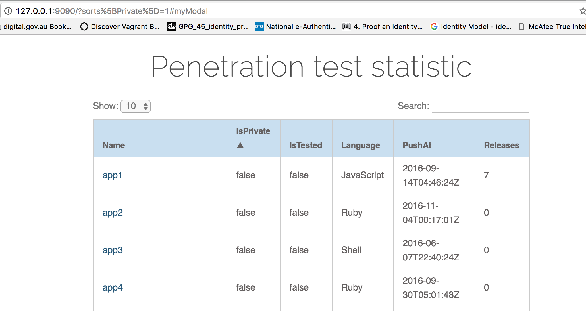

### Pentest managing golang app

This repo is now abandoned as I have decided to do something differently and this was a good learn-to-code go app.

This app was a tech spike to use github issue to manage pentest schedule for agile projects. 

The process flow is:

Pentester tests an application at particular sha1 commit, raise a "pentest checkpoint" issue with that sha1 included in the body and tag it as "question"
Pentester finishes the test, raise the findings and close the issues

This golang app fetch information from github api periodically and look for this issue. Then it calls the comparecommits api call to see how much has changed from HEAD to the previous test (number of line changes in various file extensions, number of release tags).

This information is saved into a json file and rendered with a static page using dyntablejs as shown below 

Finally users can click on the project name to display a modal about the projects, the comments fromt the last few commit to decide whether it needs to be tested.
